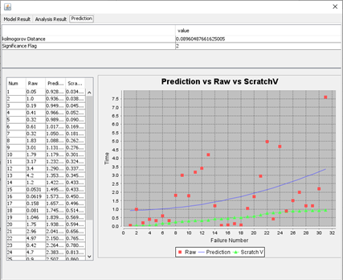
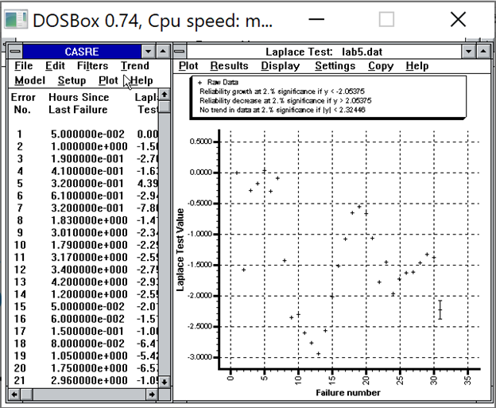
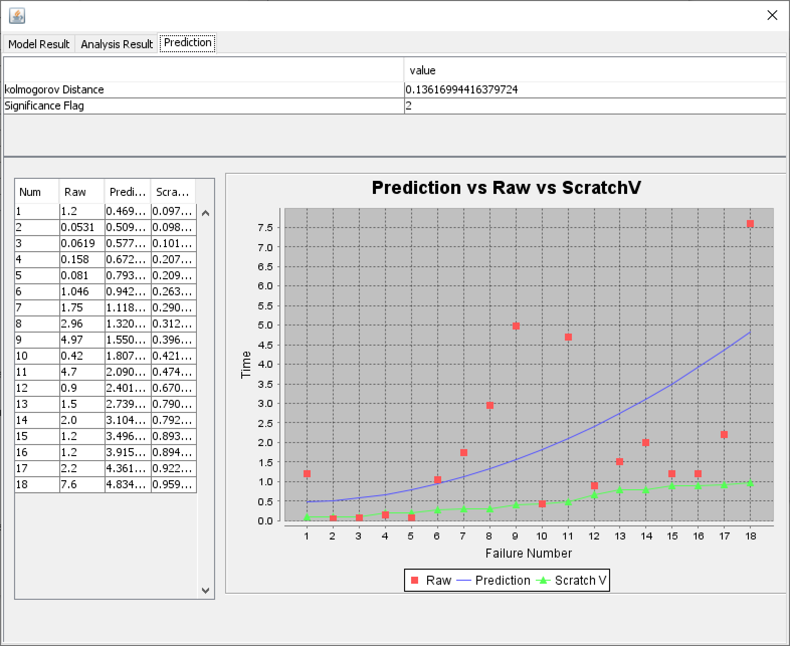
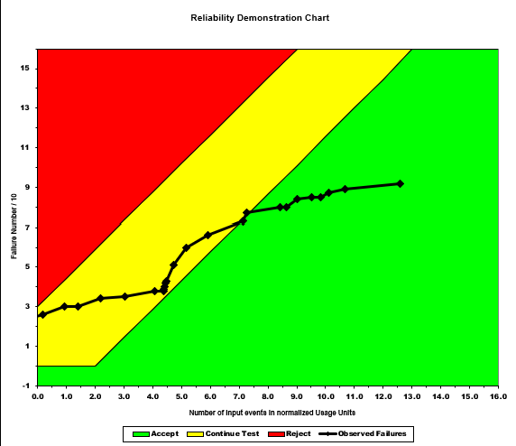

**SENG 438- Software Testing, Reliability, and Quality**

**Lab. Report \#5 – Software Reliability Assessment**

| Group \#:       | 30  |
|-----------------|---|
| Student Names:  | Agam Aulakh  |
|                 | Melanie Nguyen  |
|                 | Jeff Roszell  |
|                 | Heidi Schaefer  |

# Introduction
The purpose of this lab was to familiarize ourselves with different methods of reliability testing. Reliability growth testing was performed using ________ (SRTAT CASRE C-SFRAT SwEET). Reliability demonstration charts were used to check if MTTF is sufficient for the system's needs. The same hypothetical SUT was analyzed for each section.

# 

# Assessment Using Reliability Growth Testing 
### Reliability Growth Prediction - All Points (SRTAT)

To select the model that would provide the best fit for the project data, SRTAT was used to test each column of time data (execution time, failure identification work in person hours, computer time failure identification) using all available models (Geometric, Jelinski/Moranda De-Eutrophication, Littlewood and Varral's Bayesian Reliability, John Musa's Basic Execution Time, John Musa's Logarithmic Poisson, and Non-homogeneous Poisson). This method was used because CASRE provided no models to use for model ranking. Most models in SRTAT threw various errors when a prediction was attempted; however, we found that Littlewood and Varral's Bayesian Reliability model fit the execution time data best.

### Laplace Test (CASRE)

In order to determine the range of useful data, a Laplace test was conducted using CASRE. Execution time in hours was used for hours since last failure, and failure count was used for severity, as there was no severity ranking given. From the Laplace test, successive data points with Laplace Test Value between -2 and +2 were chosen as valid points. These data points were on time intervals 15-31. The reliability growth prediction was tested again with the new data points as shown below.

### Reliability Growth Prediction - Points Selected from Laplace Test (SRTAT)

As shown in both reliability growth predictions (all points and selected points), as time increases, the number of failures increases more slowly. This shows that the SUT is becoming more reliable as time goes on.

# Assessment Using Reliability Demonstration Chart 
To create the reliability demonstration charts, the cumulative failure count and execution times were used. The RDC-11 Excel document allowed us to scale the data to better fit the provided chart.

For a discrimination ratio of 2.0, and developer and user risks of 1%, the above chart was created. Initially, and until the 80th error, the chart is in the continue region. After the 80th error, the chart reaches the accept region, and stays in this region until the testing has completed.

# 

# Comparison of Results
Both the results of the reliability growth prediction, and the results of the reliability demonstration chart show that as the software testing continued, the failure rate became more acceptable. 

# Discussion on Similarity and Differences of the Two Techniques
Reliability growth testing allows for graphical representation of reliability trends. Different models can be used to determine a best fit graph for the data. These graphs can show whether reliability is predicted to be increasing, decreasing, or stable. The sample size must be quite large to allow for an accurate trend to be determined. This test shows the growth/decay of reliability, but not whether it is acceptable to the developer and customer.

Reliability demonstration charts are used to determine whether the SUT is acceptable to the developer and customer using risk probabilities and failure intensity estimation. One benefit is that different levels of risk and failure intensities can easily be experimented with, as shown in the results above. However, it does not calculate the reliability of the system, only whether or not the system is acceptable to the developer and customer. The sample size does not need to be as large as the sample size for reliability growth testing.

# How the team work/effort was divided and managed
All team members worked on all sections of the lab, both on our own time and in a group. Results received from the programs were discussed as a group, and the best graphs were collectively chosen from all different programs, models and inputs.

# Difficulties encountered, challenges overcome, and lessons learned
The main difficulties encountered were figuring out how to format the data and run the programs. In this lab, we learned how to format data from an Excel file into the desired .txt or .dat files when given examples. We learned that some data collections do not apply to some reliability growth models, and that it is necessary to find the correct model to analyze the data. We learned how to run DOSBox and Windows 3.1, and how to read a Laplace test chart to determine valid data points. We also learned how to interpret reliability demonstration charts and reliability growth predictions.

# Comments/feedback on the lab itself
This lab had very few instructions, which made it difficult to determine which data to use, and how to format it correctly for the given programs. SRTAT did not work on macOS, and it was initially very difficult to figure out how to run CASRE using the DOSBox with no instructions. There was also an error in the SYSTEM.ini file for the DOSBox, which had to be researched and altered in order to run Windows 3.1. CASRE did not have any models to use model ranking with, so it could only be used for the Laplace test, and we could not perform model ranking. Once the programs were running, and we learned how to format the data correctly, the lab was beneficial to visualize how reliability growth predictions and reliability demonstration charts work, and how they change when given varying data. More instructions are needed for this lab, as the majority of time spent on it was spent figuring out how to run the programs instead of analyzing the data.
